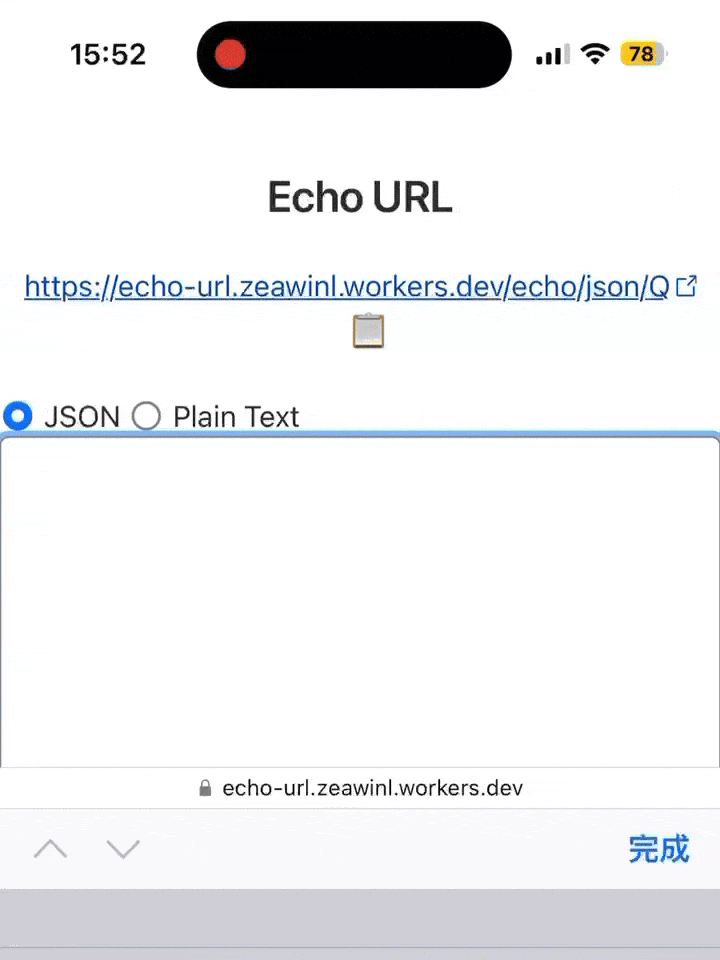

# 概述

echo-url 是开箱即用的回显 HTTP 请求的 Serverless 应用. 

# 在线地址

[echo.p2gg.com](https://echo.p2gg.com)

# 例子

# 许可

根据 Apache 2.0 许可证授权。

# Overview

echo-url is a Serverless application that echoes HTTP requests out of the box.

# example

# License

Licensed under the [Apache 2.0 License](https://github.com/thesomeexp/echo-url/blob/main/LICENSE).